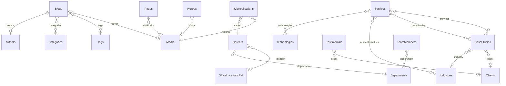
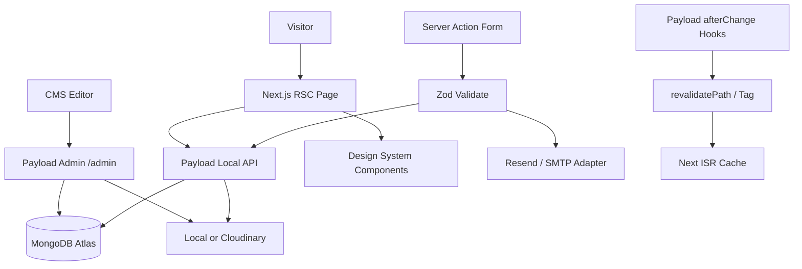
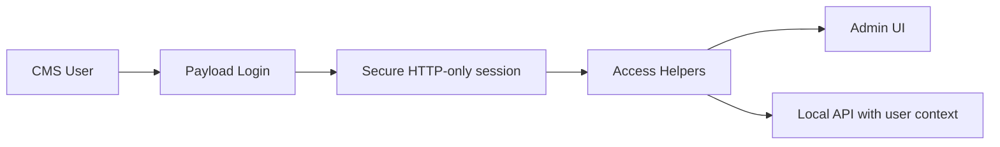
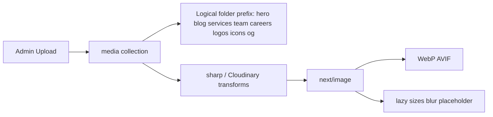
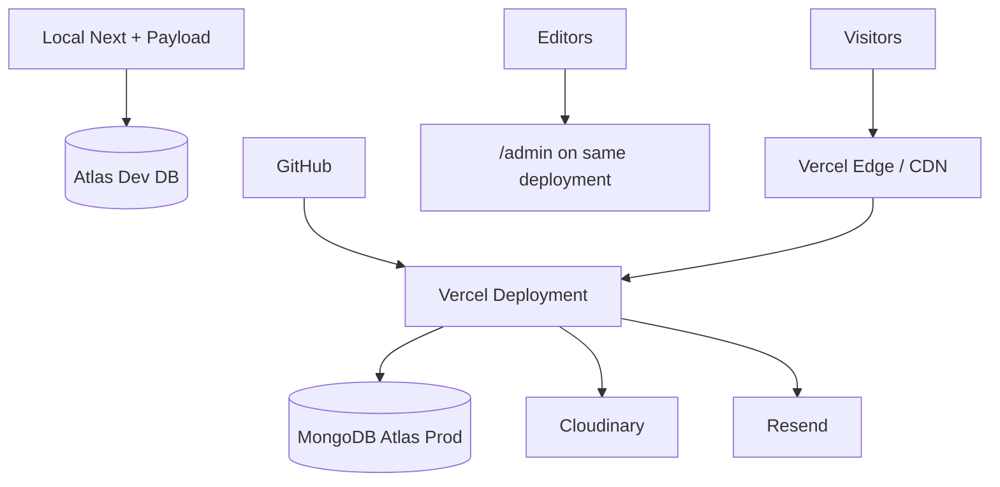

# Phase 4 — Enterprise Software Architecture

**Status:** Awaiting approval (architecture only — no code until approved)  
**Brand:** Xelarvis Technologies · **Domain:** xelarvis.in  
**Depends on:** [PHASE-2-UX-BLUEPRINT.md](./PHASE-2-UX-BLUEPRINT.md) · [PHASE-3-DESIGN-SYSTEM.md](./PHASE-3-DESIGN-SYSTEM.md)  

**Principle:** Payload CMS is the single source of truth. The Next.js frontend consumes Local API data only. No hardcoded marketing content in production. No business logic inside presentational components. Strict TypeScript. Production-ready files only — never placeholders.

**Stack:** Next.js 15 App Router · React 19 · TypeScript · Tailwind · Payload CMS 3 · MongoDB Atlas · Framer Motion · shadcn/ui · Zod · Resend (email)

---

## Locked architectural decisions

| Decision | Choice |
|---|---|
| App shape | Single Next.js app; Payload admin at `/admin` (not a monorepo) |
| Data access | Payload **Local API** via Server Components + Server Actions |
| REST | Only Payload’s built-in `/api/*` for admin/plugins — no custom public REST for content |
| Content | All pages/sections from Payload `pages` blocks + domain collections |
| Media | Payload `media`; local disk in development; Cloudinary in staging/production |
| Search | `@payloadcms/plugin-search` |
| SEO | `@payloadcms/plugin-seo` + Next Metadata API + JSON-LD |
| Revalidation | `revalidatePath` / `revalidateTag` from Payload hooks + ISR defaults |
| Auth (CMS) | Payload Users with granular roles (see §6) |
| Forms | Server Actions → collections + optional Resend; honeypot + rate limit |
| Fallbacks | Build-time safe empty states only when CMS unreachable; never fake “lorem” as product content |

---

## Gap map (current → target)

Existing Phase 1 foundation already has many collections. Phase 4 **extends** rather than rewrite:

| Target | Current | Action |
|---|---|---|
| Tags | Missing | Add collection |
| Technology Stack | Missing | Add collection; relate to Services/Solutions |
| Departments | Missing (career field text) | Add collection; relate Careers + Team |
| Hero Sections | Inside Pages blocks | Keep blocks; optional reusable `heroes` collection for shared heroes |
| Contact Messages / Newsletter | `form-submissions` | Split or subtype into dedicated collections for clarity |
| Roles beyond 3 | admin / editor / content-manager | Expand role enum + access helpers |
| Globals: Social, Analytics, Cookie, Announcement | Partially in Site Settings | Promote to dedicated globals |
| Folder reorg | Flat `components/` | Align to enterprise tree below without breaking imports |
| Solutions | Present | Keep (Phase 2 nav) |

---

## 1. Final Folder Structure

```
src/
├── app/
│   ├── (frontend)/                    # Public marketing site
│   │   ├── layout.tsx
│   │   ├── loading.tsx
│   │   ├── error.tsx
│   │   ├── not-found.tsx
│   │   ├── page.tsx                   # Home (CMS page slug: home)
│   │   ├── about/
│   │   ├── solutions/ + [slug]/
│   │   ├── services/ + [slug]/
│   │   ├── industries/ + [slug]/
│   │   ├── insights/
│   │   ├── blog/ + [slug]/
│   │   ├── case-studies/ + [slug]/
│   │   ├── careers/ + [slug]/
│   │   ├── contact/
│   │   ├── search/
│   │   ├── privacy-policy/
│   │   ├── terms/
│   │   └── globals.css                # imports design-system tokens
│   ├── (payload)/                     # Admin + Payload routes
│   │   ├── admin/[[...segments]]/
│   │   ├── api/[...slug]/
│   │   ├── api/graphql/
│   │   ├── layout.tsx
│   │   └── custom.scss
│   ├── sitemap.ts
│   └── robots.ts
├── actions/                           # Server Actions only (forms, revalidate)
├── access/                            # Payload access control
├── collections/                       # Payload collection configs
├── globals/                           # Payload globals
├── fields/                            # Shared fields (slug, seo tabs, published)
├── blocks/                            # Payload block defs + React renderers
│   ├── config/                        # block field configs
│   └── render/                        # RSC renderers
├── components/
│   ├── ui/                            # shadcn primitives (design system)
│   ├── layout/                        # Shell: Navbar, Footer, Container, Section
│   ├── navigation/                    # MegaMenu, MobileDrawer, Breadcrumb
│   ├── hero/
│   ├── sections/                      # Marketing section compositions
│   ├── cards/                         # Domain cards
│   ├── forms/
│   ├── feedback/                      # Empty, Error, Skeleton, Toast
│   ├── animations/
│   └── shared/
├── design-system/                     # tokens.css, typography, motion
├── hooks/                             # Client hooks only
├── lib/
│   ├── payload.ts                     # getPayload singleton
│   ├── cms/                           # query helpers (no UI)
│   ├── seo/                           # metadata + JSON-LD builders
│   ├── email/                         # Resend/SMTP adapter
│   ├── security/                      # rate limit, honeypot, headers
│   ├── media.ts
│   └── utils.ts
├── providers/                         # Client providers (toast, live preview)
├── plugins/                           # Payload plugins (seo, search, cloudinary)
├── hooks/payload/                     # Payload afterChange revalidate hooks
├── seed/
├── types/                             # App-level types; payload-types.ts generated
└── payload.config.ts
```

**Layering rule**

```
UI (components) → lib/cms queries → Payload Local API → MongoDB
Server Actions → Zod validate → Payload create → Email adapter
```

UI never imports Mongo drivers. Collections never import React.

---

## 2. Payload Collections

| Collection | Slug | Purpose | Drafts |
|---|---|---|---|
| Users | `users` | Auth + roles | — |
| Media | `media` | Uploads + focal/alt | — |
| Pages | `pages` | Composable pages via **blocks** | Yes |
| Heroes | `heroes` | Reusable hero configs (optional share) | Yes |
| Services | `services` | Service catalog | Yes |
| Industries | `industries` | Industry pages | Yes |
| Solutions | `solutions` | Cross-cutting solution themes | Yes |
| Case Studies | `case-studies` | Proof / featured projects | Yes |
| Blogs | `blogs` | Articles | Yes |
| Authors | `authors` | Blog authors | — |
| Categories | `categories` | Blog categories | — |
| Tags | `tags` | Blog tags | — |
| Testimonials | `testimonials` | Quotes | — |
| Clients | `clients` | Logos / names | — |
| Team Members | `team-members` | Leadership / team | — |
| Departments | `departments` | Org units for careers/team | — |
| Careers | `careers` | Job openings | Yes |
| FAQs | `faqs` | Reusable Q&A | — |
| Technologies | `technologies` | Stack items (FE/BE/Cloud/…) | — |
| Office Locations | `office-locations` | *or keep as global array* — prefer **collection** if multi-office CRUD grows; Phase 4 default: **global** `office-locations` for simplicity, upgrade if >5 offices |
| Contact Messages | `contact-messages` | Contact + general enquiry | — |
| Newsletter Subscribers | `newsletter-subscribers` | Email list | — |
| Job Applications | `job-applications` | Career applications + resume | — |
| Search | `search` | Plugin-managed index | — |

### Pages blocks (structured, not generic text)

`hero` · `trustBar` · `richText` · `aboutPreview` · `servicesGrid` · `industriesStrip` · `whyChooseUs` · `caseStudyFeature` · `technologyGrid` · `processSteps` · `testimonials` · `insightsStrip` · `careerCta` · `ctaBand` · `statsRow` · `faqAccordion` · `featureSplit` · `teamGrid` · `clientLogos`

### Field typing rules

Use **relationship / array / group / blocks / select / number / date / email / upload** — never a free-text blob where structured fields exist (e.g. metrics as `array[{label,value}]`, not one textarea).

### SEO fields (plugin + extras)

On all public content collections: SEO title, description, OG image, canonical, noIndex, keywords (optional), breadcrumb label. Structured data generated in `lib/seo` from document shape.

### Slug strategy

Shared `slugField(source)`: auto from title, unique, indexed, editable, lowercase kebab validation, collision check in `beforeValidate`.

### Draft / versions

`versions.drafts.autosave` on Pages, Heroes, Services, Industries, Solutions, Case Studies, Blogs, Careers. Scheduled publish via Payload schedule plugin or `publishedAt` + cron later; document as Phase 4.1 if schedule plugin not enabled day one — **locked default:** use `publishedAt` gating + draft status; add native schedule when Payload schedule is configured in env.

---

## 3. Globals

| Global | Slug | Contents |
|---|---|---|
| Site Settings | `site-settings` | name, tagline, logo, favicon, legal entity |
| Navigation | `navigation` | primary links, mega menu refs, CTA |
| Footer | `footer` | columns, newsletter flag, copyright |
| Contact Information | `contact-details` | email, phone, WhatsApp, hours |
| Office Locations | `office-locations` | locations array |
| SEO Defaults | `seo-defaults` | title template, default description, default OG |
| Social Links | `social-links` | linkedin, twitter/x, github, youtube |
| Analytics | `analytics` | GA/GTM IDs (mirror env; CMS override optional) |
| Cookie Banner | `cookie-banner` | enabled, copy, policy link |
| Announcement Bar | `announcement-bar` | enabled, message, href, dismissible |

Access: public **read**; `canManageContent` / admin **update**.

---

## 4. Relationships



**Careers location:** relationship to office location entry (global nested id or lightweight `locations` collection). Prefer embedding `location` select synced from offices for v1, relationship when offices are a collection.

---

## 5. Data Flow Diagram



**Fetching defaults**

- RSC + `getPayload()`  
- `revalidate = 60` on listings; on-demand revalidate on publish  
- `depth` explicit per query (avoid over-fetch)  
- Streaming via `loading.tsx` / Suspense boundaries around below-fold sections  

---

## 6. Authentication Flow



### Roles (granular)

| Role | Capabilities |
|---|---|
| `super-admin` | All + user/role management + globals + plugins |
| `administrator` | All content + globals; no destructive user ops without super |
| `editor` | Create/update/publish content collections |
| `content-manager` | Create/update drafts; no publish |
| `marketing` | Blogs, Pages (marketing blocks), Testimonials, Clients, Newsletter, Announcement, SEO |
| `recruiter` | Careers, Job Applications, Departments, Team (read) |
| `viewer` | Read-only admin |

Public site has **no** end-user auth in v1.

---

## 7. Media Flow



- Required `alt`  
- `prefix` / folder taxonomy via upload prefix or `folder` select field  
- Production: Cloudinary adapter when `CLOUDINARY_*` set  
- Never hotlink random URLs in CMS-authored content for core imagery (Unsplash only for empty-state scaffolding during migration, removed once seeded)

---

## 8. SEO Strategy

| Layer | Implementation |
|---|---|
| Per-document | SEO plugin fields + slug + noIndex |
| Routing | Clean canonicals from `NEXT_PUBLIC_SITE_URL` + path |
| Metadata API | `generateMetadata` per route from CMS doc |
| Sitemap | `app/sitemap.ts` — published only |
| Robots | `app/robots.ts` — disallow `/admin` |
| JSON-LD | Organization, WebSite, Article, JobPosting, BreadcrumbList, FAQPage where relevant |
| Breadcrumbs | From nav hierarchy + document title |
| Open Graph | OG image from doc or SEO defaults global |
| Indexing | Drafts never public; `authenticatedOrPublished` access |

---

## 9. Environment Variables

Extend `.env.example` with environment isolation:

```bash
# ─── Runtime ─────────────────────────────────────────────────
NODE_ENV=development
APP_ENV=development                    # development | staging | production
NEXT_PUBLIC_SITE_URL=http://localhost:3000

# ─── Payload / DB ─────────────────────────────────────────────
PAYLOAD_SECRET=
DATABASE_URI=
PAYLOAD_ADMIN_EMAIL=
PAYLOAD_ADMIN_PASSWORD=

# ─── Media ────────────────────────────────────────────────────
CLOUDINARY_CLOUD_NAME=
CLOUDINARY_API_KEY=
CLOUDINARY_API_SECRET=
CLOUDINARY_FOLDER=xelarvis

# ─── Email ────────────────────────────────────────────────────
EMAIL_PROVIDER=resend                  # resend | smtp
RESEND_API_KEY=
EMAIL_FROM=noreply@xelarvis.in
EMAIL_TO=hello@xelarvis.in
RESEND_FROM_EMAIL=Xelarvis <noreply@xelarvis.in>
CONTACT_NOTIFY_EMAIL=hello@xelarvis.in
SMTP_HOST=
SMTP_PORT=
SMTP_USER=
SMTP_PASS=

# ─── Security ─────────────────────────────────────────────────
RATE_LIMIT_WINDOW_MS=60000
RATE_LIMIT_MAX=10
FORM_HONEYPOT_FIELD=website

# ─── Analytics (optional; globals may override) ───────────────
NEXT_PUBLIC_GA_MEASUREMENT_ID=
NEXT_PUBLIC_GTM_ID=

# ─── Preview ──────────────────────────────────────────────────
PREVIEW_SECRET=
```

| Env | Site URL | Media | Email | Indexing |
|---|---|---|---|---|
| Development | localhost | Local | Optional | N/A |
| Staging | staging host | Cloudinary | Resend test | `noindex` default via robots or SEO defaults |
| Production | https://xelarvis.in | Cloudinary | Resend verified domain | Full index |

---

## 10. Deployment Architecture



| Concern | Approach |
|---|---|
| Hosting | Vercel (Next + Payload serverless/node) |
| Install | `npm install --legacy-peer-deps` (see `vercel.json`) |
| DB | MongoDB Atlas; IP allowlist / VPC as needed; tune `maxIdleTimeMS` for serverless |
| Secrets | Vercel env per environment |
| Headers | CSP, secure cookies, CSRF via Payload, rate limit on actions |
| Logging | `console` + structured errors in prod; optional Sentry later (`SENTRY_DSN`) |
| Preview | Live Preview with `PREVIEW_SECRET` + draft mode |
| CI | lint + `next build` on PR |

### Security checklist

- Helmet-equivalent headers via `next.config` headers  
- CSP allowlist for Cloudinary + analytics  
- CSRF: Payload defaults + same-site cookies  
- XSS: React escaping + Lexical sanitization  
- Rate limit Server Actions  
- Honeypot on public forms  
- Env isolation — no prod secrets in staging  

### Performance checklist

- RSC default; client islands for motion/forms only  
- `next/image` + AVIF/WebP  
- Dynamic import heavy client widgets (carousel)  
- Prefetch primary nav  
- Bundle: no accidental admin code in `(frontend)`  

---

## API & validation strategy

| Concern | Rule |
|---|---|
| Reads | Server Components → Local API |
| Mutations (forms) | Server Actions + Zod |
| CMS validation | Payload field `validate` + hooks |
| Types | `payload generate:types` → `payload-types.ts`; app types wrap generated types; **strict**; no `any` |
| Errors | `not-found.tsx`, `error.tsx`, action field errors, graceful CMS-down empty states |

---

## Forms matrix

| Form | Store | Notify | Spam |
|---|---|---|---|
| Contact | `contact-messages` | Resend → `CONTACT_NOTIFY_EMAIL` | Honeypot + rate limit |
| General enquiry | same (type enum) | same | same |
| Newsletter | `newsletter-subscribers` | optional double-opt later | honeypot |
| Career apply | `job-applications` + resume media | recruiter email | honeypot + file type/size limits |

---

## Search strategy

`@payloadcms/plugin-search` indexes: pages, services, industries, solutions, blogs, careers, case-studies.  
UI: `/search?q=` + header/mobile search. Priorities: services > solutions > industries > case-studies > blogs > careers > pages.

---

## Live Preview

Payload `livePreview` breakpoints already configured. Wire frontend `LivePreviewListener` + draft mode cookie gated by `PREVIEW_SECRET`. Editors preview unpublished Pages/Services/Blogs before publish.

---

## Implementation sequence (after approval only)

1. Reorganize folders + design-system tokens (Phase 3) without behavior regressions  
2. Extend roles, globals, Tags, Technologies, Departments; split form collections  
3. Strengthen relationships + SEO fields + revalidate hooks  
4. Harden forms (Zod, honeypot, rate limit, email adapter)  
5. Live Preview + draft mode  
6. Security headers + env matrix  
7. Then Phase 5: page UI against Phase 2 IA using Phase 3 components  

---

## Approval gate

| # | Deliverable | Status |
|---|---|---|
| 1 | Final Folder Structure | Documented |
| 2 | Payload Collections | Documented |
| 3 | Globals | Documented |
| 4 | Relationships | Documented |
| 5 | Data Flow Diagram | Documented |
| 6 | Authentication Flow | Documented |
| 7 | Media Flow | Documented |
| 8 | SEO Strategy | Documented |
| 9 | Environment Variables | Documented |
| 10 | Deployment Architecture | Documented |

**Approve this document before any Phase 4 code.** After approval: production-ready migrations only — no placeholders, no hardcoded marketing copy, no duplicated logic.
