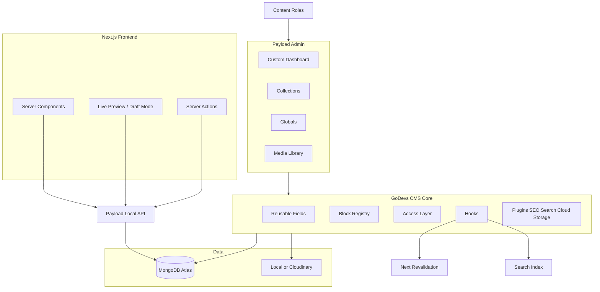
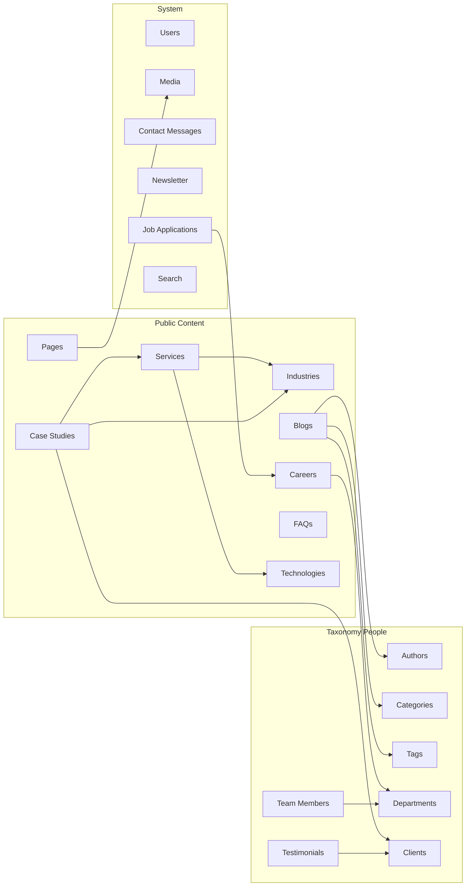
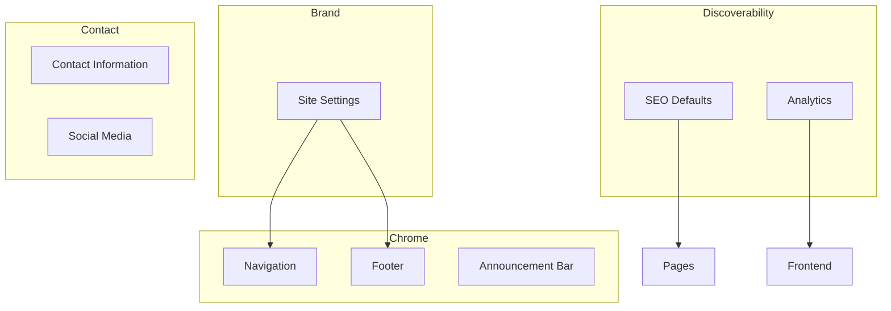
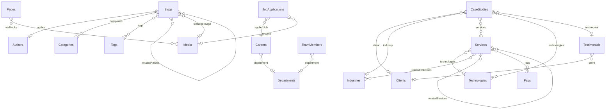
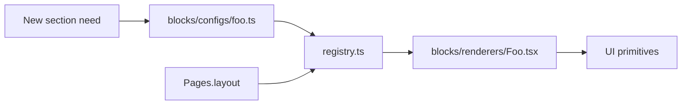
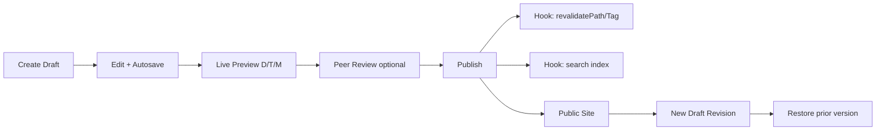

# Phase 5 — GoDevs Enterprise CMS

**Product name:** GoDevs Enterprise CMS  
**Status:** Awaiting approval (architecture only — no code until approved)  
**Purpose:** Internal Payload CMS starter that powers ~90% of future GoDevs corporate websites with little or no structural change.  
**Depends on:** [PHASE-4-SOFTWARE-ARCHITECTURE.md](./PHASE-4-SOFTWARE-ARCHITECTURE.md) (app shell) · [PHASE-3-DESIGN-SYSTEM.md](./PHASE-3-DESIGN-SYSTEM.md) (UI tokens, later) · [PHASE-2-UX-BLUEPRINT.md](./PHASE-2-UX-BLUEPRINT.md) (IA patterns, client-agnostic)

**Non-goals for this phase:** Client-branded copy, Xelarvis-only collections, hardcoded homepage React sections, one-off fields that cannot be reused.

**Core rule:** Editors never need developers for content, navigation, SEO, CTAs, or homepage composition. Frontend renders CMS data only. New homepage sections = new **Payload blocks** (config + renderer registration), not one-off page forks.

---

## Design principles (starter-kit mindset)

| Principle | Meaning |
|---|---|
| Configurable over coded | Layout via Pages + Blocks; brand via Site Settings globals |
| Generic naming | `services`, `industries`, `case-studies` — not client product names |
| Localization-ready | Single-locale now; every public collection/global designed for future `localization: true` |
| Strict typing | Generated `payload-types.ts`; shared field factories; no `any` |
| Access by role | Matrix below; collection-level + field-level where needed |
| Publish safely | Draft → Preview → Publish; versions + autosave; revalidate on change |
| Media taxonomy | Folders/prefixes, not scattered uploads |
| SEO everywhere | Shared SEO group/plugin on all public docs |
| Multi-tenant ready later | Site Settings + theme tokens in CMS; avoid hardwired brand strings in schemas |

---

## 1. CMS Architecture Diagram



**Package layout (future monorepo-friendly):** keep CMS under `src/` now; extract to `@godevs/cms` package when the second client project starts.

---

## 2. Collections Diagram



### Collection catalog (enterprise)

| # | Collection | Slug | Drafts | Notes |
|---|---|---|---|---|
| 01 | Pages | `pages` | Yes | Block composer; homepage = `slug: home` |
| 02 | Services | `services` | Yes | Catalog + detail |
| 03 | Industries | `industries` | Yes | Vertical pages |
| 04 | Case Studies | `case-studies` | Yes | Proof / projects |
| 05 | Blogs | `blogs` | Yes | Insights articles |
| 06 | Authors | `authors` | — | People for blogs |
| 07 | Categories | `categories` | — | Blog taxonomy + optional color |
| 08 | Tags | `tags` | — | Blog taxonomy |
| 09 | Careers | `careers` | Yes | Jobs |
| 10 | Departments | `departments` | — | Shared by careers + team |
| 11 | Team Members | `team-members` | — | People directory |
| 12 | Testimonials | `testimonials` | — | Social proof |
| 13 | Clients | `clients` | — | Logos |
| 14 | FAQs | `faqs` | — | Grouped Q&A |
| 15 | Technologies | `technologies` | — | Stack library |
| 16 | Media | `media` | — | Uploads + folders |
| 17 | Contact Messages | `contact-messages` | — | Form inbox |
| 18 | Newsletter | `newsletter-subscribers` | — | Subscribers |
| 19 | Job Applications | `job-applications` | — | ATS-lite |
| 20 | Users | `users` | — | Auth + roles |
| — | Search | `search` | — | Plugin-owned |

**Optional starter extensions (disabled by default flags in config):** `solutions`, `heroes` (shared hero library), `locations` (if offices outgrow global array). Enable per project via `cms.config.ts` feature flags — not forked schemas.

### Field blueprints (high level)

**Pages:** title, slug, status, SEO, hero (group or block), layout **blocks[]**, author (relationship users/authors), publishedAt, timestamps.

**Services:** name, slug, shortDescription, longDescription (rich), heroBanner, icon (upload or lucide key select), featureImage, technologies[], benefits[], features[], process[], faqs[], relatedServices[], cta (CTA field), SEO, status, order, featured.

**Industries:** name, slug, overview, problems[], solutions[], benefits[], relatedServices[], heroImage, gallery[], statistics[], cta, SEO, status, featured, order.

**Case Studies:** projectName, client (rel), industry (rel), duration, technologies[], overview, challenges, solution, outcome, gallery[], metrics[], testimonial (rel), SEO, status, featured.

**Blogs:** title, slug, author, categories[], tags[], thumbnail, featuredImage, readingTime (auto hook), excerpt, content (rich), toc (checkbox/auto), relatedArticles[], featured, SEO, publishedAt, status.

**Authors:** name, photo, role, bio, socialLinks.

**Categories:** name, slug, description, color.

**Careers:** title, department, employmentType, location, experience, salary (group: show/hide, range, currency), overview, responsibilities, requirements, benefits, applyCta, status, SEO, featured, order.

**Team Members:** name, designation, department, photo, bio, socialLinks, displayOrder, featured.

**Testimonials:** clientName, company / client rel, role, photo, review, rating, industry, featured.

**Clients:** companyName, logo, website, industry, featured.

**FAQs:** question, answer, category (select/text), order.

**Technologies:** name, category (FE/BE/Cloud/DevOps/AI/DB/CMS/Other), logo, description.

**Contact Messages:** name, company, email, phone, subject, message, status, notes, timestamps.

**Newsletter:** email, status, subscribedAt.

**Job Applications:** candidateName, email, phone, resume, job (rel), coverLetter, experience, portfolioUrl, status, notes.

### Universal field policy (public content)

Where it makes sense, every public content collection includes: **slug**, **status** (`draft`/`published` via versions), **featured**, **SEO group**, **publishedAt**, **author** (where editorial), plus Payload **createdAt / updatedAt**. System collections (messages, applications) use **status** workflows instead of public publish.

---

## 3. Globals Diagram



| Global | Slug | Fields (summary) |
|---|---|---|
| Site Settings | `site-settings` | siteName, tagline, logo, logoDark, favicon, themeTokens (primary/secondary — optional CSS vars), footerCopyright |
| Navigation | `navigation` | desktopMenu[], mobileMenu[], ctaButton, stickyHeader (bool), announcementBar (embed or rel to announcement global) |
| Footer | `footer` | quickLinks, services links, industries links, contact blurb, social (rel/global), newsletter enabled, legal links |
| SEO Defaults | `seo-defaults` | defaultMetaTitle, defaultMetaDescription, defaultOgImage, twitterCard, defaultSchema org, robots defaults |
| Contact Information | `contact-information` | phone, email, whatsapp, address (group), googleMapsEmbed, businessHours, emergencyContact |
| Social Media | `social-media` | linkedin, instagram, facebook, youtube, twitter, github |
| Analytics | `analytics` | gaId, gtmId, metaPixel, linkedinPixel, clarityId |
| Announcement Bar | `announcement-bar` | enabled, message, ctaLabel, ctaLink, expiresAt |

All globals: public read; write restricted by role.

---

## 4. Relationship Diagram



---

## 5. Access Control Matrix

| Capability | Super Admin | Administrator | Editor | Marketing | Recruiter | Viewer |
|---|---|---|---|---|---|---|
| Users / roles | CRUD | — | — | — | — | — |
| Globals (brand, nav, footer, SEO, analytics, announcement) | CRUD | CRUD | R | R* | R | R |
| Pages / Services / Industries / Case Studies | CRUD+Publish | CRUD+Publish | CRUD+Publish | Pages publish | R | R |
| Blogs / Authors / Categories / Tags | CRUD+Publish | CRUD+Publish | CRUD+Publish | CRUD+Publish | R | R |
| Careers / Departments / Applications | CRUD | CRUD | R | R | CRUD apps + careers | R |
| Team / Clients / Testimonials / FAQs / Technologies | CRUD | CRUD | CRUD | Testimonials/Clients | R | R |
| Contact Messages / Newsletter | CRUD | CRUD | R | CRUD | R | R |
| Media | CRUD | CRUD | CRUD | CRUD | Upload resume-related | R |
| Publish vs draft | Yes | Yes | Yes | Yes (marketing scopes) | Careers only | No |

\*Marketing may update Announcement Bar + Analytics view; lock Analytics write to Admin+ unless project flag says otherwise.

**Frontend:** public read via `authenticatedOrPublished` (or equivalent) for draft-enabled collections; form collections create via Local API `overrideAccess` in Server Actions only.

---

## 6. Folder Structure (Payload package)

```
src/
├── access/                 # role helpers, published gates
├── collections/            # one file (or folder) per collection
├── globals/
├── blocks/
│   ├── registry.ts         # slug → config + renderer key
│   ├── configs/            # Payload block field configs
│   └── renderers/          # RSC renderers (frontend)
├── fields/                 # reusable field factories
│   ├── slug.ts
│   ├── seo.ts
│   ├── cta.ts
│   ├── hero.ts
│   ├── button.ts
│   ├── socialLinks.ts
│   ├── address.ts
│   ├── gallery.ts
│   ├── richContent.ts
│   └── publishedAt.ts
├── hooks/
│   ├── slug.ts
│   ├── readingTime.ts
│   ├── revalidate.ts
│   └── searchSync.ts       # if not fully covered by plugin
├── plugins/
│   ├── seo.ts
│   ├── search.ts
│   ├── cloudStorage.ts
│   └── index.ts
├── utilities/
│   ├── deepMerge.ts
│   ├── formatSlug.ts
│   └── featureFlags.ts     # enable optional collections
├── admin/
│   ├── dashboard/          # custom dashboard components
│   └── graphics/
└── payload.config.ts
```

---

## 7. Reusable Fields

| Field factory | Shape | Used by |
|---|---|---|
| `slugField(from)` | text, unique, validated, auto | All public docs |
| `seoField()` | group / plugin tabs: title, description, og, canonical, robots, keywords | Public collections |
| `ctaField()` | label, href, style (primary/secondary/ghost), openInNewTab | Services, Industries, Blocks, Nav |
| `buttonField()` | same as CTA, single button | Heroes, banners |
| `heroField()` | eyebrow, heading, subheading, media, primaryCta, secondaryCta | Pages, Services, Industries |
| `socialLinksField()` | platform URLs group | Authors, Team, globals |
| `addressField()` | line1, line2, city, region, postal, country | Contact global |
| `galleryField()` | upload hasMany + caption | Case studies, industries |
| `richContentField()` | Lexical richText with controlled features | Long form |
| `publishedAtField()` | date, sidebar | Public content |
| `featuredField()` | checkbox | Lists / homepage queries |
| `orderField()` | number | Manual sort |

Validation: required flags, max lengths (e.g. meta title 60, description 160, excerpt 300), admin `description` + `placeholder` on every editor-facing field.

---

## 8. Blocks Architecture

**Rule:** Homepage (and any landing page) is a **block array**. Do not ship giant page-level rich text as the layout mechanism.

### Block registry (starter set)

| Block slug | Purpose | Typical props |
|---|---|---|
| `hero` | Primary fold | heroField |
| `statistics` | Trust metrics | items[{label,value,suffix}] |
| `services` | Service grid | heading, source: manual IDs or “latest featured” |
| `industries` | Industry strip | heading, selection mode |
| `technologyGrid` | Stack | categories filter |
| `timeline` | Process / history | steps[] |
| `testimonials` | Social proof | selection / featured |
| `clients` | Logo wall | featured |
| `faq` | Accordion | faq group or IDs |
| `cta` | Band | ctaField + heading |
| `newsletter` | Capture | heading, privacy note |
| `imageGallery` | Media | galleryField |
| `contentSection` | Prose + optional image | rich + media + layout |
| `videoSection` | Embed / upload | url or media |
| `featureGrid` | Icon features | features[] |
| `team` | People | featured / department |
| `latestBlogs` | Insights | limit, category |
| `careerBanner` | Recruit CTA | ctaField |
| `contactCta` | Lead CTA | ctaField |

### Extensibility (90% reuse target)



**Contract:** Adding a block = config + renderer + registry entry. No new route required. No homepage React rewrite.

**Data binding modes:** blocks may either embed content or **reference** collections (`relationship` / `array` of IDs) so editors reuse Services/Blogs without duplication.

---

## 9. Media Strategy

| Concern | Spec |
|---|---|
| Collection | `media` with required `alt`, optional `caption`, `folder` select |
| Folders / prefixes | `hero`, `blogs`, `services`, `industries`, `team`, `clients`, `logos`, `icons`, `documents`, `og` |
| Types | Image, SVG, PDF, Video (as needed) |
| Transforms | sharp locally; Cloudinary in staging/prod |
| Derivatives | thumbnail, tablet, desktop; WebP + AVIF delivery via `next/image` / CDN |
| UX | lazy load, blur placeholder, explicit sizes |
| Access | public read for published URLs; upload by editor+ roles |

---

## 10. Content Publishing Workflow



| Capability | Spec |
|---|---|
| Draft / Publish | `versions.drafts` on Pages, Services, Industries, Case Studies, Blogs, Careers |
| Autosave | ~400ms interval |
| Revisions | Payload versions; rollback from admin |
| Live Preview | Breakpoints desktop / tablet / mobile |
| Scheduled publish | `publishedAt` in future + cron or Payload schedule (feature flag) |
| Notifications | Optional webhook / email on contact & job application |

### Search scopes

Global `/search` + filtered: blogs, careers, services, industries (plugin collections list).

### Email events (configurable)

Contact form → admin notify + optional auto-reply  
Career application → recruiter notify + optional auto-reply  
Newsletter → store + optional welcome  

Provider: Resend or SMTP via adapter (`EMAIL_PROVIDER`).

### Admin dashboard (premium starter)

Custom `beforeDashboard` / widgets:

- Recent blogs  
- Open jobs  
- Unread contact messages  
- Pending job applications  
- Recently updated pages  
- Quick actions: New Page, New Blog, New Job, View Messages  

---

## Validation & SEO standards

- Per-field validation + character limits + admin descriptions  
- Shared SEO: meta title/description, canonical, robots, OG, Twitter card, keywords, preview  
- Structured data emitted by frontend from CMS fields (Organization from Site Settings + Social; Article/JobPosting/FAQ from docs)  

---

## Localization posture (future)

- Design all user-facing fields as localizable.  
- v1: `localization` off or single `en`.  
- Enable locales per project in `payload.config` without renaming collections.

---

## Feature flags (`utilities/featureFlags.ts`)

| Flag | Default | Purpose |
|---|---|---|
| `solutions` | off/on per project | Extra collection |
| `sharedHeroes` | off | Heroes collection |
| `locationsCollection` | off | Offices as collection |
| `scheduledPublish` | off | Cron/schedule |
| `multiBrandTokens` | on | Theme colors in Site Settings |

---

## Mapping note (existing Xelarvis repo)

When this starter is applied to the current Website repo, treat Xelarvis as **Client Project #1**: seed content + theme tokens in globals — do not bake “Xelarvis” into collection schemas. Rename product strings to GoDevs Enterprise CMS in admin meta.

---

## Approval gate

| # | Deliverable | Status |
|---|---|---|
| 1 | CMS Architecture Diagram | Documented |
| 2 | Collections Diagram | Documented |
| 3 | Globals Diagram | Documented |
| 4 | Relationship Diagram | Documented |
| 5 | Access Control Matrix | Documented |
| 6 | Folder Structure | Documented |
| 7 | Reusable Fields | Documented |
| 8 | Blocks Architecture | Documented |
| 9 | Media Strategy | Documented |
| 10 | Content Publishing Workflow | Documented |

**Do not generate Payload code until this document is approved.** After approval: implement as production-ready GoDevs Enterprise CMS core (generic schemas first, then client seed data).
