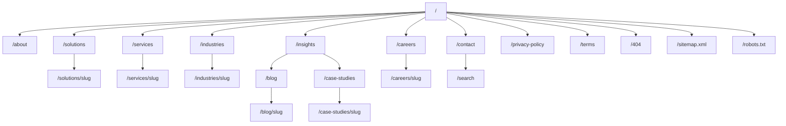
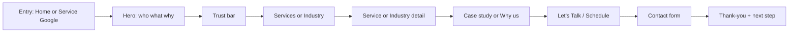
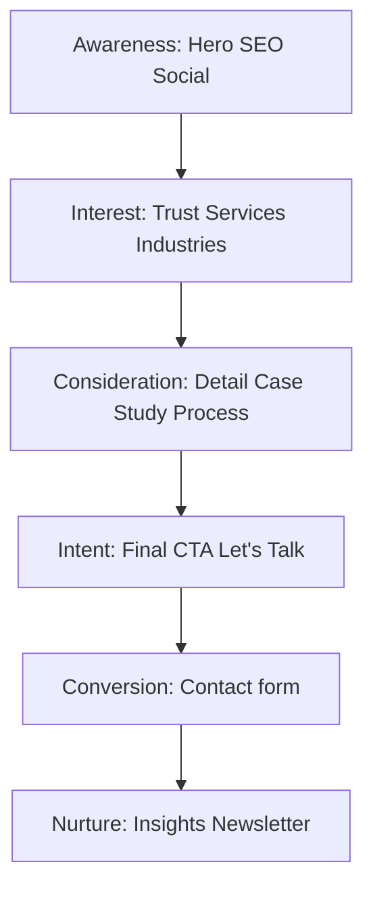

# Phase 2 — Information Architecture & UX Blueprint

**Brand:** Xelarvis Technologies · **Tagline:** Engineering Digital Excellence. · **Domain:** xelarvis.in  
**Mode:** Architecture only — no React / no visual redesign coding until approval.

**Locked decisions for this blueprint**
- Primary CTA label: **Let's Talk** → `/contact?intent=project` (pre-selects consultation intent).
- **Contact** remains a plain nav link → `/contact`; CTA is visually primary.
- **Solutions** stays in primary nav (mega menu) with routes `/solutions` and `/solutions/[slug]` — capability themes that cut across services.
- **Featured Projects** on Home map to Case Studies (`/case-studies`) for SEO continuity.
- **Insights** = thought-leadership hub; **Blog** = article index/detail under the Insights ecosystem.
- Mega menus only for **Solutions**, **Services**, **Industries** (high fan-out). Other items are direct links.

---

## 1. Complete Sitemap

| # | Page | URL | Primary goal(s) |
|---|---|---|---|
| 01 | Home | `/` | Leads + Trust + Expertise |
| 02 | About | `/about` | Trust + Recruit |
| 03 | Solutions index | `/solutions` | Expertise + Leads |
| 04 | Solution detail | `/solutions/[slug]` | Expertise + Leads |
| 05 | Services index | `/services` | Expertise + Leads |
| 06 | Service detail | `/services/[slug]` | Expertise + Leads |
| 07 | Industries index | `/industries` | Trust + Leads |
| 08 | Industry detail | `/industries/[slug]` | Trust + Leads |
| 09 | Insights hub | `/insights` | Expertise + Leads |
| 10 | Blog index | `/blog` | Expertise |
| 11 | Blog detail | `/blog/[slug]` | Expertise + soft Lead |
| 12 | Case studies | `/case-studies` | Trust + Expertise |
| 13 | Case detail | `/case-studies/[slug]` | Trust + Leads |
| 14 | Careers | `/careers` | Recruit |
| 15 | Job detail | `/careers/[slug]` | Recruit |
| 16 | Contact | `/contact` | Leads |
| 17 | Privacy | `/privacy-policy` | Trust (compliance) |
| 18 | Terms | `/terms` | Trust (compliance) |
| 19 | Search | `/search` | Expertise + UX |
| 20 | 404 | `not-found` | Recover → Lead/nav |
| 21 | Sitemap / Robots | `/sitemap.xml`, `/robots.txt` | SEO |

**Industry detail content model (10):** Healthcare, Manufacturing, Education, Retail, Finance, Logistics, Government, Telecommunications, Energy, Real Estate — each: Description · Problems · Solutions · CTA.

---

## 2. User Journeys

### Journey A — Enterprise buyer (Lead)

**Success:** Form submit with company + need. Secondary: booked consultation intent.

### Journey B — Technical evaluator (Expertise → Trust)

Entry via Insights/Blog or Technology stack → Related service → Case study → Soft CTA (newsletter or Talk).

### Journey C — Talent (Recruit)

Careers (culture + benefits) → Job detail → Apply form → Confirmation. Soft path: About culture → Careers.

### Journey D — Recovery (404 / Search)

404: search + top services + Let's Talk. Search: typed results across services, industries, blogs, jobs.

---

## 3. Conversion Funnel

| Stage | Page moments | CTA copy | KPI |
|---|---|---|---|
| Awareness | Home hero | Start Your Project | CTR to contact or services |
| Interest | Trust bar, Services grid, Industries | Explore Services / View industry | Depth scroll, service clicks |
| Consideration | Service detail, Case study, Process | See how we work / View project | Time on page, related clicks |
| Intent | Final CTA, sticky nav CTA | Schedule a Consultation / Let's Talk | Contact visits |
| Conversion | Contact form | Send message | Form submits |
| Recruit branch | Career CTA, Careers, Job | Join Our Team / Apply | Applications |
| Expertise branch | Insights, Blog | View all insights | Returning visitors |

**Form conversion rules**
- Prefill `service` / `industry` / `intent` from query params.
- One primary action per viewport; secondary is always quieter (outline/text).
- Never stack two equal-weight CTAs in the same band.

---

## 4. Navigation Hierarchy

### Desktop primary (L→R)

1. Logo → `/`
2. **Solutions** (mega)
3. **Services** (mega)
4. **Industries** (mega)
5. **Insights** (direct; footer/blog secondary)
6. **Careers** (direct)
7. **About** (direct)
8. **Contact** (text link)
9. **Let's Talk** (accent button → `/contact?intent=project`)

### Mega menu content

| Trigger | Columns | Footer of mega |
|---|---|---|
| Solutions | Featured themes (3–6) + short descriptor | View all solutions |
| Services | Grouped: Consulting · Engineering · Cloud/DevOps · AI · Design/Staffing | View all services |
| Industries | 2×5 grid of 10 industries | Talk to an industry expert |

### Nav behavior (UX spec)

| State | Behavior |
|---|---|
| Over hero | Transparent / frosted; light text if hero is dark photography |
| After scroll > hero threshold | Solid white/surface; border-bottom; dark text |
| Scroll down | Hide header (translateY -100%) after 80px down |
| Scroll up | Reveal immediately |
| Focus / keyboard | Always visible when focus inside nav |
| Reduced motion | Instant show/hide; no slide |

### Mobile drawer

- Full-viewport panel; animate in from right (or fade+Y if reduced motion).
- Order: Search → Primary links → Social → **Let's Talk** (sticky footer of drawer) → Contact phone/email.
- Close on route change and Escape; focus trap; return focus to menu button.

### Footer hierarchy

Company · Services · Industries · Resources (Insights, Blog, Case Studies, Search) · Legal · Social · Newsletter · Copyright.

---

## 5. Content Hierarchy

### Global reading rules

- Max paragraph measure ~**65ch**.
- One H1 per page; section H2; supporting H3.
- Every section: **Purpose → Hierarchy → Spacing → CTA → Motion → A11y**.
- Whitespace is intentional rhythm (section padding), not empty dead zones — pair every open area with a clear focal element (headline, metric, or CTA).

### Home story arc (must read as narrative)

| Order | Section | Purpose | Goal | Section CTA |
|---|---|---|---|---|
| 1 | Hero | Who / what / why in one viewport | Lead | Start Your Project · Explore Services |
| 2 | Trust bar | Immediate proof | Trust | — (logos/metrics; no competing CTA) |
| 3 | Who we are | Mission/vision/values preview | Trust | Learn more → About |
| 4 | Core services | Capability map | Expertise | Service cards → detail |
| 5 | Industry expertise | Domain fit | Trust/Lead | Industry → detail |
| 6 | Why choose us | 6 advantages (timeline) | Trust | — or soft link to About |
| 7 | Featured projects | Proof of delivery | Trust/Expertise | View case study |
| 8 | Technology expertise | Stack credibility | Expertise | Explore solutions |
| 9 | Development process | Reduce delivery risk | Trust | Start a project |
| 10 | Testimonials | Social proof | Trust | — |
| 11 | Insights | Thought leadership | Expertise | View all insights |
| 12 | Career CTA | Employer brand | Recruit | Open positions |
| 13 | Final CTA | Close the story | Lead | Schedule a Consultation |
| 14 | Footer | Wayfinding + newsletter | All | Subscribe |

**Hero copy contract:** Large type, minimal lines, photographic office/engineering background (no blobs/fake gradients). Answers who/what/why before fold.

**Trust bar metrics:** Years · Projects · Countries · Clients · Support availability · Technology partners.

**Why choose us (6):** Enterprise Support · Experienced Team · Modern Technologies · Scalable Solutions · Transparent Process · Long-term Partnership.

**Process timeline:** Discovery → Planning → UI/UX → Development → Testing → Deployment → Support.

### Page content maps (summary)

- **About:** Hero → Story → Mission → Vision → Values → Leadership → Timeline → Achievements → Technology → Culture → CTA.
- **Services index:** Listing · Categories · Search · Filters · Featured · CTA.
- **Service detail:** Overview → Challenges → Solution → Benefits → Technologies → Process → Related → FAQs → CTA.
- **Industry detail:** Description → Problems → Solutions → Related services → CTA.
- **Insights:** Featured + categories + latest strip → Blog.
- **Blog index:** Search · Categories · Latest · Trending · Pagination · Newsletter.
- **Blog detail:** Reading time · Author · Date · TOC · Body · Share · Related · CTA.
- **Careers:** Culture · Benefits · Openings · Hiring process · FAQs · Apply CTA.
- **Job detail:** Responsibilities · Requirements · Benefits · Apply form.
- **Contact:** Hero · Form · Offices · Map · Hours · Email · Phone · Social · FAQ.

---

## 6. UX Improvements vs reference / Phase 1

*(Reference file present as WhatsApp walkthrough video; binary not decodable here without ffmpeg. Improvements below close gaps vs Phase 1 implementation and typical IT-agency template patterns.)*

| Area | Typical reference / Phase 1 gap | Phase 2 improvement |
|---|---|---|
| Home | Discrete section dump | Single story arc with intentional handoffs |
| Nav | Flat sticky always-on | Transparent→solid, hide-on-down / reveal-on-up, mega menus |
| CTA language | Generic “Talk to us” | Differentiated: Start Your Project / Let's Talk / Schedule a Consultation by stage |
| Trust | Buried or missing above fold | Trust bar immediately after hero |
| Industries | Fewer, thin pages | 10 industries with Problems → Solutions → CTA |
| Services | Static grid only | Index search + filters + featured |
| Proof | Weak or icon-led | Featured projects (case studies) + realistic testimonials |
| Process | Hidden or bullet list | Visual 7-step timeline reducing buying anxiety |
| Tech | Logo soup | Interactive stack groups (FE/BE/Cloud/DevOps/AI/DB/CMS) |
| Recruit | Footer-only careers | Dedicated Career CTA band on Home + full careers UX |
| Blog | List only | TOC, reading time, share, related, newsletter |
| Contact | Form alone | Form + offices + map + hours + FAQ (reduce friction) |
| Empty space | Decorative voids or icon filler | Every open region tied to hierarchy or CTA |
| A11y | Often ignored in agency templates | Focus-visible nav, drawer trap, reduced-motion, 65ch measure |
| Performance | Heavy carousels everywhere | One testimonial carousel; elsewhere static or CSS scroll |
| SEO structure | Shallow | Explicit Insights vs Blog vs Case Studies roles |

### Gaps to close in later implementation (vs current code)

Current Phase 1 ([`SiteHeader`](src/components/layout/SiteHeader.tsx), [`page.tsx`](src/app/(frontend)/page.tsx), [`DEFAULT_NAV`](src/lib/fallback-data.ts)) lacks: mega menus, scroll-aware hide/reveal, home story sections (trust → career → final CTA), services filters, expanded industries, TOC/share on blog, careers hiring-process block. Phase 2 architecture defines those before any component work.

---

## Approval gate

Approve this blueprint to unlock **Phase 3 (UI/visual system + implementation against this IA)**. Until then: no React section builds, no nav behavior coding.
