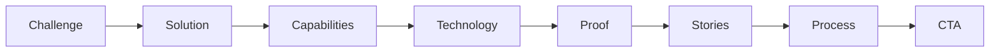
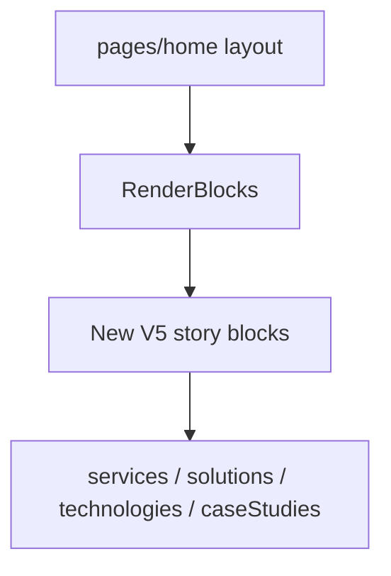

# Xelarvis V5 — Storytelling Redesign

## Diagnosis

The site is technically sound but reads as a **catalog of card grids**. Homepage ([`src/app/(frontend)/page.tsx`](<src/app/(frontend)/page.tsx>)) renders CMS blocks from seed order: Hero → Stats → About → ServicesGrid → IndustriesStrip → TechnologyGrid → Blogs → CTA. Most listing pages share compact [`PageHero`](src/components/layout/PageHero.tsx) + card grids. Motion exists ([`AnimateIn`](src/components/motion/AnimateIn.tsx), [`AmbientBackground`](src/components/layout/AmbientBackground.tsx), [`HeroProductVisual`](src/components/marketing/HeroProductVisual.tsx)) but does not create section-to-section surprise.

**Constraint honored:** Do not redesign `ServiceCard` / `SpotlightCard` / shared UI primitives. Build **new story compositions** that present the same CMS data differently.

## Visual identity (Xelarvis signature)

Someone should recognize a screenshot as Xelarvis, not Tailwind UI.

| Element | Direction                                                                                                                                                  |
| ------- | ---------------------------------------------------------------------------------------------------------------------------------------------------------- |
| Palette | Keep brand tokens in [`src/design-system/tokens.css`](src/design-system/tokens.css): `#0F172A` / `#0D9488` / `#06B6D4` / `#F8FAFC` / white                 |
| Motif   | **Clinical constellation** — navy depth, teal–cyan data threads that draw on scroll, soft glass instrumentation, overlapping layers (not purple SaaS glow) |
| Type    | Lean hard into Space Grotesk display: oversized chapter lines, asymmetric type, numbers in open space                                                      |
| Rhythm  | Alternate density: full-bleed visual → typography void → interactive object → proof strip — never grid → grid                                              |
| Motion  | Framer Motion only: elegant, Apple/Stripe pace — draw lines, count-up, slow mesh, orbit, sticky chapters. No noisy bounce                                  |

## Architecture

Homepage stays **Payload-driven** (`pages` slug `home` → [`RenderBlocks`](src/blocks/RenderBlocks.tsx)).

Add a **V5 story block family** (new Payload blocks + React sections). Seed replaces the catalog `homeLayout` with the narrative sequence. Existing blocks remain for About and other pages; home stops using ServicesGrid / IndustriesStrip / TechnologyGrid as consecutive rhythm.

## Phase 1 — Homepage narrative (primary ship)

Replace seeded `homeLayout` in [`src/seed/index.ts`](src/seed/index.ts) with **10 unique sections**. Each has a different layout and a visual hero (not another card grid).

| #   | Story beat   | Layout / visual                                                                                                                | New block (approx.) |
| --- | ------------ | ------------------------------------------------------------------------------------------------------------------------------ | ------------------- |
| 1   | Open         | Full-viewport hero: brand-forward, gradient mesh + floating glass dashboard (new composition; not reuse of listing `PageHero`) | `storyHero`         |
| 2   | Challenge    | Massive typography + thin rules; problem statements in open space                                                              | `storyChallenge`    |
| 3   | Solution     | Sticky left chapter / scrolling right narrative (scroll-driven)                                                                | `storySolution`     |
| 4   | Capabilities | Horizontal scroll rail of capabilities (no CSS card grid)                                                                      | `storyCapabilities` |
| 5   | Technology   | Animated **technology orbit** (SVG/CSS + motion; constellation motif)                                                          | `storyTechOrbit`    |
| 6   | Proof        | Large counting metrics floating in space (typography, not tiles)                                                               | `storyProof`        |
| 7   | Success      | Case-study theater / carousel (one dominant story at a time)                                                                   | `storyCases`        |
| 8   | Process      | Interactive process (click/hover stages; line draw)                                                                            | `storyProcess`      |
| 9   | Presence     | Soft glass testimonials or global presence strip (lines + type; not card grid)                                                 | `storyPresence`     |
| 10  | Close        | Massive full-bleed CTA                                                                                                         | `storyCta`          |

**Implementation touchpoints**

- Payload block configs under `src/payload/blocks/` + register in blocks index
- React under `src/blocks/story/` (or similarly named) + wire in `RenderBlocks`
- Shared motif utilities: e.g. `src/components/marketing/ConstellationCanvas.tsx`, `MeshBackdrop.tsx`, `OrbitDiagram.tsx` — homepage-owned visuals, not generic cards
- Seed: new `homeLayout` + copy for Challenge → CTA story
- `npm run generate:types` / import map after schema
- Re-seed or manually update published `home` page in admin so live CMS picks up the new layout

**Signature interactions (homepage-scoped)**

- Mesh / constellation slowly drifts; cursor subtly affects blobs
- Orbit nodes react on hover; lines draw in-view
- Numbers count once in view
- Sticky solution chapters lock/unlock with scroll
- CTA button glow on hover (subtle)

## Phase 2 — Unique page heroes + de-catalog listings

After homepage lands, give each main IA page a **different hero composition** (Rule 10) and break card-grid monotony on first scroll:

| Page         | Hero direction (distinct)                                               |
| ------------ | ----------------------------------------------------------------------- |
| Services     | Horizontal capability ribbon / split type                               |
| Solutions    | Editorial list with oversized titles (extend current divide-y language) |
| Industries   | Map or sector constellation                                             |
| Technologies | Full-bleed orbit (reuse orbit motif, different framing)                 |
| Careers      | People/atmosphere full-bleed + type                                     |
| About        | Timeline or mission typography void                                     |
| Insights     | Magazine masthead / asymmetric feature                                  |

Listing bodies: prefer typography lists, sticky filters, or single-column reveals over “PageHero + 3-column cards forever.” Domain cards may still appear where interaction needs a container — not as the default section wallpaper.

## Explicit non-goals

- No separate admin app; no ripping Payload collections/auth
- No global restyle of `ServiceCard` / `SpotlightCard` / shadcn primitives
- No purple SaaS look, no stacked identical card sections on home
- No Three.js / heavy 3D unless a light CSS/SVG orbit proves insufficient (default: SVG + Framer Motion)

## Quality bar

Hard-refresh home and scroll: **no two consecutive sections share layout grammar**. If a section could be swapped onto a random SaaS template unchanged, it fails. Prefer Awwwards/Stripe Sessions energy with clinical-AI craft over template polish.

## Delivery order

1. Motif primitives + `storyHero` / `storyChallenge` (prove identity)
2. Remaining story blocks + seed `homeLayout`
3. Wire RenderBlocks, types, seed/update CMS home
4. Phase 2 unique heroes for the seven marketing pages
5. Pass for rhythm, mobile, reduced-motion (`prefers-reduced-motion`)
