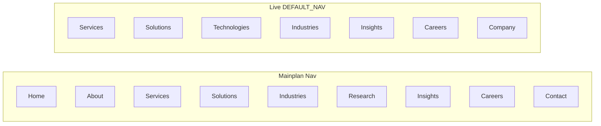

# Consolidated Mainplan Alignment

## Verdict

[plans/Mainplan.md](plans/Mainplan.md) is the **content/IA source of truth**. The app already implements a large share of it (5 service pillars, careers Why Join + Hiring Process + job detail/apply, insights hubs, about pages, dual-theme UI). Several **nav labels, child trees, and copy blocks** are out of sync. The older architecture plan ([plans/xelarvis_enterprise_website_d874513c.plan.md](plans/xelarvis_enterprise_website_d874513c.plan.md)) is **stale** (greenfield todos still pending; tagline “Engineering Digital Excellence” vs live “Engineering Intelligent Solutions…”).

**Default for this consolidation:** sync public IA + seed/copy + missing marketing sections. **Defer** Mainplan’s full HR recruitment dashboard (interview scheduling, email templates, multi-role ATS) to a later phase—Payload already has careers + job-applications basics.

---

## What already matches

| Mainplan area                                     | Live status                                                                                                                         |
| ------------------------------------------------- | ----------------------------------------------------------------------------------------------------------------------------------- |
| 5 core services (titles + summaries)              | [FALLBACK_SERVICES](src/lib/fallback-data.ts) + `/services`                                                                         |
| Service process / benefits (IT, Clinical, etc.)   | Seed + [ServiceDetailNarrative](src/components/services/ServiceDetailNarrative.tsx) + process block on `[slug]`                     |
| Careers Why Join (8 bullets)                      | [WHY_JOIN](src/lib/site-ia.ts) + [WhyJoinSection](src/components/careers/WhyJoinSection.tsx)                                        |
| Hiring Process (8 steps)                          | [HIRING_STEPS](src/lib/site-ia.ts) + [HiringProcessSection](src/components/careers/HiringProcessSection.tsx)                        |
| Job detail + apply form fields                    | [JobDetailView](src/components/careers/JobDetailView.tsx) + [CareerApplicationForm](src/components/forms/CareerApplicationForm.tsx) |
| Insights: Blogs / White Papers / News / Resources | Routes under `/insights/*`                                                                                                          |
| Company Overview hero copy                        | About hero + [ABOUT_PAGES](src/lib/site-ia.ts) company-overview                                                                     |
| Search                                            | [site-search.ts](src/lib/site-search.ts) (fixed empty-index gap)                                                                    |
| Dual-theme UI pass                                | Recent careers/services/industries/insights/about redesigns                                                                         |

---

## Gaps / diffs (must call out)

### 1. Primary navigation

- Live: no Home link; **Company** instead of **About**; **Technologies** instead of **Research & Innovation**; Contact is header CTA only ([DEFAULT_NAV](src/lib/fallback-data.ts)).
- Research exists as `/ai-research-lab` + [RESEARCH_MEGA](src/lib/site-ia.ts), not top-level nav.

**Sync decision:** Rename Company → About; add Research & Innovation mega (wire `RESEARCH_MEGA`); keep Technologies as a page under Research or Company (do not drop the route). Keep Contact as CTA + `/contact`.

### 2. About children

| Mainplan                | Live                                                       |
| ----------------------- | ---------------------------------------------------------- |
| Company Overview        | `/about/company-overview`                                  |
| Vision & Mission        | `/about/vision-mission`                                    |
| Leadership Team         | `/about/leadership`                                        |
| Technology & Innovation | **Missing** (closest: `/technologies`, `/ai-research-lab`) |
| Our Approach            | **Missing**                                                |
| Research Philosophy     | **Missing**                                                |
| —                       | Extra: Why XELARVIS, Global Presence                       |

**Sync decision:** Keep Why XELARVIS + Global Presence. Add three content pages (or map Technology & Innovation → existing tech/research routes with Mainplan copy). Fill [ABOUT_PAGES](src/lib/site-ia.ts) + seed.

### 3. Services nesting

Mainplan lists **sub-capabilities** under each pillar (e.g. Generative AI, NLP under AI). Live has **only the 5 pillar pages**—no child routes.

**Sync decision:** Keep one page per pillar; surface sub-capabilities as in-page sections/chips on `/services/[slug]` (from Mainplan lists), not new URLs—avoids CMS explosion.

### 4. Solutions naming

Mainplan vs [FALLBACK_SOLUTIONS](src/lib/fallback-data.ts) differ (e.g. “Healthcare AI Platforms” vs “Healthcare Solutions”; “AI-Powered Digital Products” missing; “Clinical Research Solutions” is live-only).

**Sync decision:** Rename/seed solutions to Mainplan titles; add missing product solution; keep Clinical Research if still seeded in CMS.

### 5. Industries

Mainplan: 6 sectors (incl. Enterprise Technology). Live: 8 (adds Pharma, Biotech, Logistics; Education vs “Education Technology”; no Enterprise Technology).

**Sync decision:** Prefer Mainplan labels where they conflict; keep Pharma/Biotech/Logistics as they match business focus; add Enterprise Technology or map to Technology & Startups copy from Mainplan §Industries.

### 6. Insights

Mainplan puts **Case Studies** under Insights; live has `/case-studies` separate and Insights mega without cases. Missing: Industry Insights, Reports & Research Briefs, Events & Webinars, nested Resource downloads.

**Sync decision:** Add Case Studies link into Insights mega; add stub/content pages or InsightsType entries for Industry Insights / Reports / Events only if content exists—otherwise single “Reports” type page with placeholder CMS collection later.

### 7. Collaborations

Mainplan top-level Collaborations tree. Live: `/ai-research-lab/collaborations` + Technology Ecosystem block.

**Sync decision:** No new top nav; deepen research collaborations page + footer link.

### 8. Careers extras

Mainplan: Life at XELARVIS, Graduate Programs. Live careers page: Why Join, Hiring, Open Roles, Internship / Research / Benefits blurb sections—not full pages. Job cards missing Posted Date / Deadline in UI (schema may have fields).

**Sync decision:** Add Life at XELARVIS section (or page); Graduate Programs blurb; extend [JobCard](src/components/domain/JobCard.tsx) if CMS fields exist.

### 9. Contact intents

Mainplan: Business Enquiry, Research Collaboration, Career Enquiry, General Contact. Verify [contact page](<src/app/(frontend)/contact/page.tsx>) intent query params cover these; align labels/copy.

### 10. Admin / HR (out of this sync phase)

Mainplan §Admin Recruitment Dashboard (statuses, interview scheduling, email templates, roles) is **far ahead** of current Payload careers/applications. Document as Phase 2; do not block public IA sync.

### 11. Stale architecture plan

Update or archive [plans/xelarvis_enterprise_website_d874513c.plan.md](plans/xelarvis_enterprise_website_d874513c.plan.md) todos to reflect “site exists”; brand tagline in that file is outdated.

---

## Implementation plan (after approval)

### A. Single source of truth

- Rewrite [plans/Mainplan.md](plans/Mainplan.md) front section into a short **“Live IA (aligned)”** tree that matches what we will ship (nav + routes).
- Keep long-form service process copy in Mainplan as CMS/seed reference; trim duplicate “PROCESS OF SERVICE 4” clinical section when seeding.

### B. Nav + mega menus

- Update [DEFAULT_NAV](src/lib/fallback-data.ts) + seed navigation global: About, Research & Innovation mega, Insights mega includes Case Studies.
- Update [SiteHeader.tsx](src/components/layout/SiteHeader.tsx) mega map (`company` → about, add research).

### C. Content sync (seed + site-ia + fallbacks)

- Align solution/industry titles and about pages with Mainplan wording.
- Expand service detail content: sub-capability lists + ensure process steps match Mainplan 7-step flows where seed already has process arrays.
- Careers: Life at XELARVIS + Graduate Programs content blocks on [careers/page.tsx](<src/app/(frontend)/careers/page.tsx>).

### D. Missing lightweight pages

- About: Technology & Innovation, Our Approach, Research Philosophy (ContentPage + ABOUT_PAGES + ABOUT_MEGA).
- Insights: wire Case Studies into mega; optional Reports/Events list pages using existing InsightsTypePage pattern if collections exist—else static ContentPage stubs.

### E. Contact intents

- Align enquiry types/labels with Mainplan’s four intents.

### F. Quality gate

- Run lint/typecheck on touched files; fix any issues before calling the phase done.
- No new HR dashboard work in this phase.

### G. Doc consolidation

- Produce one **Consolidated Mainplan** section at top of Mainplan.md: Live nav, route map, gap log (done vs deferred), and pointer that UI redesigns (glass/theme) stay as-is unless content requires layout change.

---

## Explicitly deferred (Phase 2)

- Full ATS: application statuses, interview scheduling, email templates, Super Admin / HR / Hiring Manager roles beyond current Payload admin.
- Deep nested service URLs for every sub-capability.
- Events & Webinars CMS product.
- Campus/graduate application flows as separate products.
