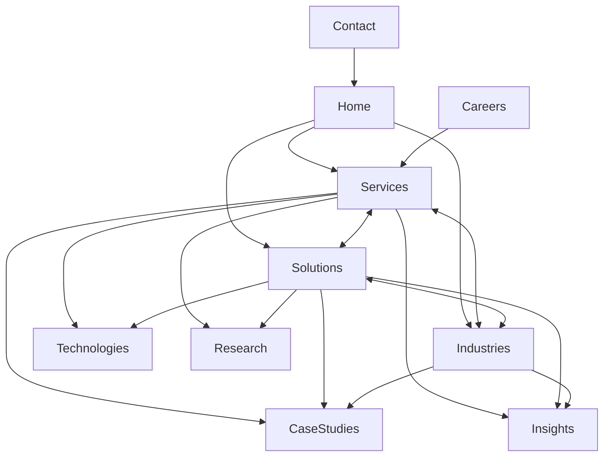

# Execute 23-08-26 Plan Changes

## Context

[`plans/23-08-26_Planchnages.md`](plans/23-08-26_Planchnages.md) is a ~4,300-line IA/CMS redesign (currently **0 bytes on disk** — editor buffer only; Phase 0 saves it). The site already has collections and routes for Services, Solutions, Industries, Technologies, Case Studies, Blogs, Research, Careers — but **related content is mostly hardcoded** in [`src/lib/site-ia.ts`](src/lib/site-ia.ts) / [`src/lib/seo-content.ts`](src/lib/seo-content.ts), and many CMS relationship fields are **not rendered** on public pages.

## Decisions locked (from plan + brand rules)

| Conflict in plan                                | Decision                                                                                                                                                                               |
| ----------------------------------------------- | -------------------------------------------------------------------------------------------------------------------------------------------------------------------------------------- |
| Services vs Capabilities nav rename             | Keep public nav/URLs as **Services** (`/services`). Use “capabilities” as section copy (“Our Capabilities”), not a route rename (avoids SEO breakage).                                 |
| Healthcare as 5th service vs specialty brand    | Keep Healthcare as **5th service + Tier‑1 industry + solution**, but **order and messaging** stay AI → Data Science → IT Consulting first; Healthcare framed as specialized expertise. |
| 8 vs 9 solutions                                | Keep **9 solutions** (including Custom AI Products).                                                                                                                                   |
| Delivery framework (6-step plan vs live 9-step) | Unify to plan’s **6-step**: Discover → Strategize → Design → Build → Deploy → Optimize in About, Home process, SEO copy, and seed.                                                     |
| Clinical SAS/SDTM as “technologies”             | Keep clinical items as **capability/content**, not Technology catalog entries (Technologies = engineering stack).                                                                      |

Credibility rules still apply: no invented metrics, client counts, or “we serve N industries” proof claims.

---

## Phase 0 — Persist and inventory

1. Save [`plans/23-08-26_Planchnages.md`](plans/23-08-26_Planchnages.md) to disk (file is empty on disk today).
2. Inventory current CMS docs (5 services, solutions, industries) vs plan catalogs; list gaps for seeding later.
3. Note existing relationship fields vs missing edges (see Phase 1).

---

## Phase 1 — CMS relationship graph (foundation)

Extend Payload collections so related pages are **data-driven**, not hard-coded.

**Add / complete fields**

- [`Services.ts`](src/payload/collections/Services.ts): add `relatedSolutions` → solutions (today only Solutions→Services exists; Services page uses `SERVICE_PAGE_EXTRAS`).
- [`Solutions.ts`](src/payload/collections/Solutions.ts): add `relatedIndustries`, `relatedCaseStudies`, `relatedResearch`, `relatedInsights` (blogs), optional FAQs; keep `relatedServices`, `technologies`.
- [`Industries.ts`](src/payload/collections/Industries.ts): change inline `solutions[]` text toward `relatedSolutions` → solutions; surface existing `relatedServices` / `relatedCaseStudies`; add `relatedTechnologies`, `relatedResearch`, `relatedInsights` as needed.
- [`Technologies.ts`](src/payload/collections/Technologies.ts): optional reverse is not required if joins stay on Service/Solution; ensure category covers AI/data/cloud/devops/frontend/backend (not clinical standards).
- [`CaseStudies.ts`](src/payload/collections/CaseStudies.ts): add `relatedSolutions`, `technologies` (keep `services`, `industry`).
- [`Research.ts`](src/payload/collections/Research.ts) + [`Blogs.ts`](src/payload/collections/Blogs.ts): add optional `relatedServices`, `relatedSolutions`, `relatedIndustries` for Insights engine.
- [`Careers.ts`](src/payload/collections/Careers.ts): add optional `relatedServices`, `relatedSolutions`, `relatedIndustries`, skills/tech text already present.

**Shared UI**

- New reusable component e.g. [`src/components/content/RelatedContent.tsx`](src/components/content/RelatedContent.tsx) that accepts CMS-resolved groups (Solutions, Industries, Technologies, Case Studies, Research, Insights, Careers, Contact) with relevance caps (~3–6 items).
- Wire it into service/solution/industry detail templates; retire hard-coded `relatedLinksFor*` / `SERVICE_PAGE_EXTRAS` gradually.

**Seed / migrate**

- Encode plan matrices (Service↔Solution↔Industry↔Tech) into seed or admin updates for the 5 services and 9 solutions.
- Cap lists per plan (don’t dump every tech on every page).

---

## Phase 2 — Terminology + one delivery framework

1. Align homepage/About copy with Service / Solution / Industry / Technology definitions (homepage already has the “Services are how we work…” line — keep and reinforce).
2. Replace competing methodologies with the **6-step XELARVIS Delivery Framework** in:
   - [`src/lib/site-ia.ts`](src/lib/site-ia.ts) (`our-approach`)
   - Home `storyProcess` seed / [`StoryProcess.tsx`](src/components/...) defaults
   - [`src/lib/seo-content.ts`](src/lib/seo-content.ts) quick answers
3. Ensure `/approach` continues to resolve to the single About approach page.

---

## Phase 3 — Services (build first, per plan)

1. Redesign [`services/page.tsx`](<src/app/(frontend)/services/page.tsx>): Hero → five capabilities → **How Our Capabilities Work Together** → Industries strip → Tech ecosystem → Case studies → Research → Insights → CTA.
2. Rebuild each [`services/[slug]/page.tsx`](<src/app/(frontend)/services/[slug]/page.tsx>) template:
   - Hero, capability cards, CMS Related Content (Solutions / Industries / Technologies / Research / Case Studies / Insights), CTA.
3. Confirm five service slugs match plan (AI, Data Science, IT Consulting, Data Engineering & Cloud, Healthcare & Clinical Data Science); fill content gaps from plan sections without inventing metrics.
4. Display order: AI, Data Science, IT Consulting, Data Engineering, Healthcare (specialty last).

---

## Phase 4 — Solutions

1. Keep **9** solution themes; landing [`solutions/page.tsx`](<src/app/(frontend)/solutions/page.tsx>): outcome framing + challenge selector (“Choose your challenge”), not a duplicate of Services.
2. Detail template: Problem → Solution → Services used → Technologies → Industries → Case Studies → Research → Insights → Who is this for? → FAQs → CTA.
3. Populate CMS relations so Related Content is automatic.

---

## Phase 5 — Industries (tiered publish)

1. Landing + shared industry template (challenges → capabilities → solutions/services → tech → cases/research/insights → FAQ → CTA).
2. **Tier 1 first** (content-ready): Healthcare & Life Sciences, Technology, Banking & Financial Services, Manufacturing.
3. **Tier 2** next: Retail & E-Commerce, Logistics & Supply Chain.
4. **Tier 3** (Education, Government, Energy) only when real content exists — keep out of primary mega/nav if thin; use cautious “areas we can support” language.
5. Render CMS `relatedServices` / `relatedSolutions` / case studies (today unused on industry pages).

---

## Phase 6 — Technologies, Research, Insights, Case Studies

1. Technologies: keep catalog; on Service/Solution pages show **Technology → Capability → Solution** chain via relations (not a dump list). No technology-only vanity pages required unless already planned.
2. Research: prefer public detail routes from `research` collection (or wire lab pages to CMS) so Related Content can deep-link.
3. Insights (`blogs`): tag/relate to services/solutions/industries; replace static related footers with CMS links.
4. Case studies: render `services`, `industry`, and new solution/tech relations on detail pages.

---

## Phase 7 — Careers, About, Home, Contact

1. Careers: job ↔ service/solution/industry fields; CMS-manage program content where feasible (openings already CMS; expand related practice links).
2. About: credibility layer + “Explore XELARVIS” hubs (Services, Research, Case Studies, Careers, Contact) — not another services pitch.
3. Home: gateway blocks to Services / Solutions / Industries / Research / Case Studies / Insights / Careers with consistent CTAs.
4. Contact remains conversion endpoint from Related CTAs sitewide.

---

## Phase 8 — Navigation + cleanup

1. Keep top nav roughly: About · Services · Solutions · Approach · Industries · Research · Insights · Careers · Contact.
2. Ensure mega menus pull related CMS docs (already partial) and respect industry tiers.
3. Remove obsolete hard-coded related maps once pages consume CMS.
4. Visual QA on key routes; no invented metrics; brand order AI → DS → IT first.

---

## Execution order (do not skip)

0 Persist plan → 1 CMS graph + RelatedContent → 2 Terminology + 6-step Approach → 3 Services landing + 5 detail pages → 4 Solutions landing + 9 details → 5 Industries Tier 1→2→3 → 6 Tech/Research/Insights/Cases wiring → 7 Careers/About/Home → 8 Nav cleanup + QA

Each phase ends with: types generate if schema changed, seed/admin content updated, and spot-check of at least one deep route (e.g. `/services/artificial-intelligence`, `/solutions/...`, `/industries/...`).

## Out of scope (explicit)

- Full ATS pipeline (Candidate → Offer → Onboarding) beyond optional job relationship fields.
- Building thin Tier‑3 industry pages with placeholder claims.
- Renaming `/services` → `/capabilities`.
- Admin sidebar work from prior chat (separate track).
