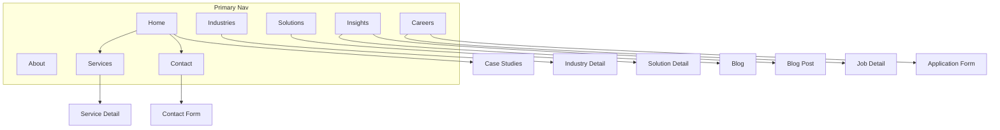
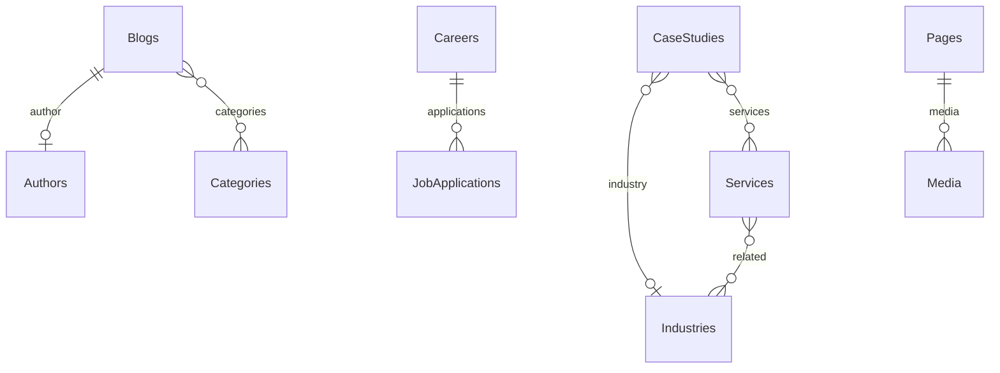

# Xelarvis Technologies — Enterprise Website Architecture

**Brand:** Xelarvis Technologies · **Tagline:** Engineering Digital Excellence. · **Domain:** [xelarvis.in](https://xelarvis.in)  
**Stack:** Next.js 15 (App Router) · React 19 · TypeScript · Tailwind · shadcn/ui · Framer Motion · Payload CMS 3 · MongoDB Atlas · Vercel · Cloudinary (prod media)

**Default locked for this build:** Single Next.js app with Payload embedded at `/admin` (not a monorepo). Local media in development; Cloudinary via `@payloadcms/plugin-cloud-storage` when `CLOUDINARY_*` is set. Typography uses **Inter** as specified (swap later via CSS variables). No finalized logo — wordmark + SVG mark slot in header/footer, replaceable without layout changes.

---

## 1. Information Architecture



| Audience need | Primary path | Business outcome |
|---|---|---|
| Trust / credibility | About, Team, Clients, Case Studies | Shortlist for RFP |
| Buy services | Services → detail → Contact | Enquiry |
| Industry fit | Industries → detail → CTA | Qualified lead |
| Thought leadership | Insights / Blog | SEO + authority |
| Hire / join | Careers → apply | Talent pipeline |
| Legal / ops | Privacy, Terms | Compliance |

---

## 2. Sitemap (routes)

| Route | Purpose | CMS source |
|---|---|---|
| `/` | Conversion hero + proof + services strip + industries + case studies + testimonials + CTA | Pages + globals |
| `/about` | Story, values, leadership, stats, clients | Pages + Team + Clients |
| `/services` | Service index | Services |
| `/services/[slug]` | Deep service page | Services |
| `/industries` | Industry index | Industries |
| `/industries/[slug]` | Industry page | Industries |
| `/solutions` | Solution themes (e.g. Cloud Modernization, AI Ops) | Solutions (or Pages blocks) |
| `/solutions/[slug]` | Solution detail | Solutions |
| `/case-studies` / `/case-studies/[slug]` | Proof of delivery | Case Studies |
| `/insights` | Hub (featured + categories) | Blogs |
| `/blog` · `/blog/[slug]` | Listing + article | Blogs + Categories + Authors |
| `/careers` · `/careers/[slug]` | Jobs + apply | Careers |
| `/contact` | Enquiry form + offices | Contact Details + Offices + Form |
| `/search` | Site search UI | `@payloadcms/plugin-search` |
| `/privacy-policy` · `/terms` | Legal | Pages |
| `/sitemap.xml` · `/robots.txt` | SEO | Next Metadata / route handlers |
| `/404` | Branded not found | Static + nav |
| `/admin` | Payload admin | Payload |

---

## 3. User flows (key)

**Enquiry (primary conversion)**  
Landing / Service / Industry → sticky or section CTA “Talk to an expert” → `/contact` (prefill `service`/`industry` query) → Server Action → FormSubmissions + optional email → thank-you state.

**Career apply**  
`/careers` → job detail → application form (resume upload to Media) → Server Action → Applications collection → confirmation.

**Content discovery**  
Nav / footer / search → Insights or Blog → related posts → soft CTA to Contact.

**Editor publish**  
Admin login (Admin / Editor / Content Manager) → draft → Live Preview → publish → ISR revalidate via Payload hooks.

---

## 4. Design system

**Tokens (CSS variables in `src/styles/tokens.css`)**

- Primary `#0F172A` · Secondary `#334155` · Accent `#2563EB`
- Success / Warning / Danger as specified
- Background `#FFFFFF` · Surface `#F8FAFC` · Dark `#020617`
- Font: Inter (900/700/600/500/400) via `next/font`
- Spacing scale: 4/8/12/16/24/32/48/64/96/128
- Radius: `0` for editorial rules · `sm`/`md` only on controls (inputs, buttons) — not on hero media
- Motion: 150–300ms ease-out; page reveal, nav underline, CTA hover, section scroll fade — Framer Motion only on client islands

**Visual direction (anti-template)**

- Full-bleed photographic heroes (real engineering / offices / infrastructure) — no inset cards in hero
- Brand wordmark as hero-level signal on home
- One job per section; generous whitespace; no icon grids as decoration
- Lucide icons monochrome, used sparingly for service affordances and UI chrome
- Photography via curated Unsplash/Pexels business sets initially; CMS Media for client replacements

**shadcn/ui primitives to install:** Button, Input, Textarea, Select, Label, Dialog, Sheet, Accordion, Tabs, Badge, Separator, Navigation Menu, Form, Sonner — themed to tokens, not default shadcn purple.

---

## 5. Component inventory

**Layout:** `SiteHeader`, `SiteFooter`, `MobileNav`, `SkipLink`, `Container`, `Section`, `PageHero`

**Marketing blocks (CMS-driven):** `HeroBanner`, `RichText`, `ServicesGrid`, `IndustriesStrip`, `CaseStudyFeature`, `TestimonialsSlider`, `TeamGrid`, `ClientLogos`, `StatsRow`, `CTABand`, `FAQAccordion`, `FeatureSplit`, `ProcessSteps`

**Domain:** `ServiceCard`, `IndustryCard`, `BlogCard`, `JobCard`, `CaseStudyCard`, `AuthorByline`, `RelatedPosts`

**Forms:** `ContactForm`, `CareerApplicationForm`, `NewsletterForm` (Server Actions)

**Utility:** `SearchDialog`, `SEOHead` (via Metadata API), `LivePreviewListener`, `AnimateIn`

No duplicate section components — blocks map 1:1 from Payload `blocks` field on Pages.

---

## 6. Payload CMS model

### Collections

| Collection | Key fields |
|---|---|
| **users** | email, roles: `admin` \| `editor` \| `content-manager` |
| **media** | alt, caption, focal; local or Cloudinary |
| **pages** | title, slug, layout blocks[], SEO, status, versions |
| **services** | title, slug, summary, icon (Lucide name), body, benefits, FAQs, related industries, SEO |
| **industries** | title, slug, summary, challenges, solutions, related services, SEO |
| **solutions** | title, slug, summary, body, related services, SEO |
| **case-studies** | title, slug, client, industry, challenge, outcome, metrics, media, SEO |
| **blogs** | title, slug, excerpt, content (Lexical), cover, author, categories, publishedAt, SEO |
| **categories** | title, slug |
| **authors** | name, role, bio, avatar, social |
| **careers** | title, slug, department, location, type, description, requirements, active |
| **testimonials** | quote, author, role, company, logo, featured |
| **team-members** | name, role, bio, photo, order, linkedIn |
| **clients** | name, logo, url, featured |
| **faqs** | question, answer, group (service/page) |
| **form-submissions** | type (contact/career/newsletter), payload JSON, file?, status |
| **job-applications** | career relation, name, email, phone, resume, coverLetter |

### Globals

| Global | Purpose |
|---|---|
| **site-settings** | site name, tagline, logo, favicon, social, analytics IDs |
| **navigation** | primary + CTA links |
| **footer** | columns, legal links, newsletter toggle |
| **contact-details** | emails, phones, WhatsApp, map embed |
| **office-locations** | address, city, country, lat/lng, hours |
| **seo-defaults** | default title template, OG image, twitter |

### Plugins & CMS features

- Lexical rich text · drafts/versions · Live Preview (`@payloadcms/live-preview-react`)
- `@payloadcms/plugin-seo` on pages/services/industries/solutions/blogs/case-studies
- `@payloadcms/plugin-search` indexing pages, services, industries, blogs, careers, case-studies
- Slug fields with `beforeValidate` uniqueness
- Access: Admin full; Editor publish content; Content Manager draft-only (no user/settings)

### Relationships (summary)



---

## 7. Folder structure

```
/
├── .env.example
├── next.config.ts                 # withPayload
├── payload.config.ts
├── src/
│   ├── app/
│   │   ├── (frontend)/            # marketing routes + layout
│   │   ├── (payload)/admin/[[...segments]]/
│   │   ├── api/[...slug]/         # Payload REST
│   │   ├── sitemap.ts
│   │   └── robots.ts
│   ├── blocks/                    # block → React map
│   ├── components/                # ui/ + layout/ + forms/ + domain/
│   ├── design-system/             # tokens, typography helpers
│   ├── lib/                       # payload.ts, seo.ts, cn.ts, email.ts
│   ├── actions/                   # contact, career, newsletter
│   ├── collections/               # Payload collection configs
│   ├── globals/
│   ├── fields/                    # shared slug, SEO, published
│   ├── hooks/                     # revalidate, slugify
│   ├── access/                    # role helpers
│   └── styles/
├── public/
└── media/                         # local uploads (gitignored)
```

---

## 8. Rendering, performance, SEO, a11y

- **RSC by default**; client only for motion, forms interactivity, mobile nav, search dialog
- **ISR:** `revalidate` + Payload `afterChange` → `revalidatePath` / `revalidateTag`
- **Images:** `next/image` + sharp; Cloudinary URLs in prod; explicit width/height/alt
- **Metadata API** per route from SEO plugin fields; JSON-LD Organization + Article + JobPosting
- **a11y:** landmark regions, skip link, focus rings, contrast AA+, keyboard nav, form labels, reduced-motion media query
- **Lighthouse targets:** Perf 95+, SEO/A11y/Best Practices 100 — measured on production build

---

## 9. Animation strategy

| Motion | Where | Intent |
|---|---|---|
| Fade + slight Y | Section enter (once) | Hierarchy, not decoration |
| Underline / color | Nav active & hover | Wayfinding |
| Opacity / translate | Button hover | CTA affordance |
| Crossfade | Testimonial / logo strip | Quiet continuity |
| None on scroll hijack | — | Avoid “AI template” feel |

---

## 10. Feature parity vs enterprise references

*(Specific client video/URL not in repo — matrix below is against Stripe / Vercel / IBM / Nagarro / Accenture / Publicis Sapient patterns you named. Share the client reference later to adjust.)*

| Area | Reference-class feature | Xelarvis plan | Upgrade beyond typical agency sites |
|---|---|---|---|
| Nav | Sparse primary + strong CTA | 8 items + “Get in touch” | Prefill contact from context |
| Home | Hero, proof, services, CTA | Same + case metrics + industries | CMS block composer |
| Services | Deep pages | Full collection + FAQs | Related industry cross-links |
| Careers | Job board + apply | Payload + file upload | JobPosting schema |
| Blog | SEO articles | Lexical + authors + categories | Search plugin + related |
| Trust | Logos, case studies | Clients + Case Studies + Team | Draft/preview workflow |
| Forms | Contact | Contact + Career + Newsletter | Stored submissions in CMS |
| SEO | Meta, sitemap | Full Metadata + sitemap/robots + JSON-LD | Per-doc SEO plugin |
| A11y | Often weak | WCAG-oriented primitives | Skip, focus, reduced motion |
| Perf | Mixed | RSC + ISR + image pipeline | Lighthouse gated |

---

## 11. Environment contract — `.env.example`

Created at repo root. **You must supply real values in `.env.local` / Vercel** for anything marked required.

```bash
# ─── App (required) ───────────────────────────────────────────
NEXT_PUBLIC_SITE_URL=http://localhost:3000
# Production: https://xelarvis.in

# ─── Payload (required) ───────────────────────────────────────
PAYLOAD_SECRET=          # long random string (openssl rand -hex 32)
DATABASE_URI=            # MongoDB Atlas connection string

# ─── First admin (seed / first boot) ──────────────────────────
PAYLOAD_ADMIN_EMAIL=     # initial admin login
PAYLOAD_ADMIN_PASSWORD=  # change after first login

# ─── Cloudinary (production media; leave empty for local media) ─
CLOUDINARY_CLOUD_NAME=
CLOUDINARY_API_KEY=
CLOUDINARY_API_SECRET=
CLOUDINARY_FOLDER=xelarvis

# ─── Email (form notifications; Resend) ───────────────────────
RESEND_API_KEY=
EMAIL_FROM=noreply@xelarvis.in
EMAIL_TO=hello@xelarvis.in

# ─── Optional analytics ───────────────────────────────────────
NEXT_PUBLIC_GA_MEASUREMENT_ID=
NEXT_PUBLIC_GTM_ID=
```

**What you need to create/provide before go-live**

1. MongoDB Atlas cluster + `DATABASE_URI` (IP allowlist / Vercel-friendly)
2. `PAYLOAD_SECRET` + first admin credentials
3. Cloudinary cloud (for production media)
4. Resend (or equivalent) API key + verified sending domain
5. DNS for `xelarvis.in` → Vercel
6. Final logo SVG when ready (slot already flexible)
7. Optional: GA/GTM IDs

---

## 12. Implementation phases (after approval)

1. Scaffold Next 15 + Payload 3 + Tailwind + shadcn + tokens + `.env.example`
2. Collections, globals, access roles, plugins (SEO, search, cloud storage adapter)
3. Seed script: navigation, sample services/industries, home blocks, legal pages
4. Frontend shell (header/footer) + block renderer + all routes
5. Forms (Server Actions) + search page + sitemap/robots + JSON-LD
6. Motion polish, a11y pass, Lighthouse on Vercel preview
7. Vercel project link, env sync, production deploy checklist

---

## 13. Out of scope (explicit)

- Custom admin UI beyond Payload
- Multi-language (i18n) — English only for v1
- Customer portal / auth for end clients
- E-commerce / payments
- Cloning any single reference site visually
